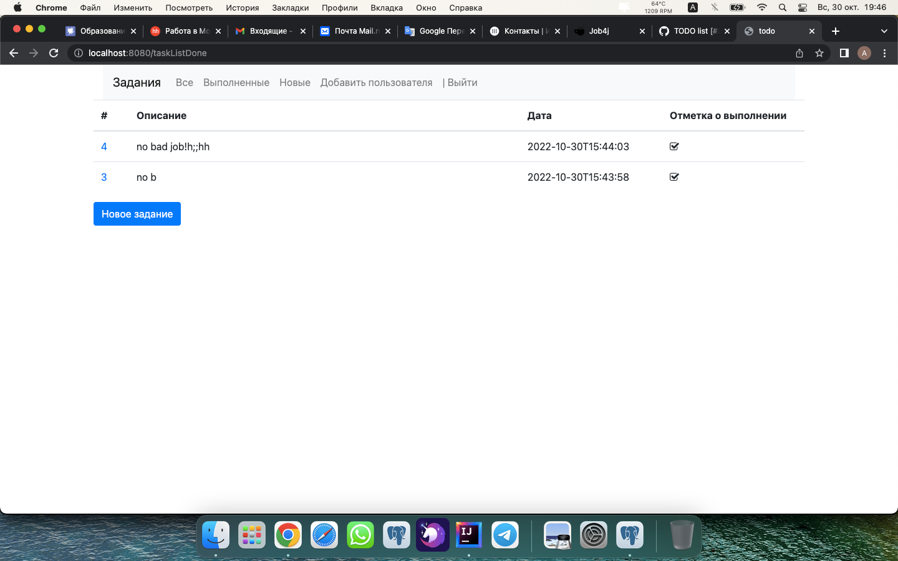

# **Сервис по выполнению заданий**

## Welcome!

_Данное приложение - Ваш on-line органайзер!_
       
## Используемые технологии:

'''
Java 18'''

"""Spring Boot (v2.7.3)"""

    Thymeleaf

    Bootstrap

    Apache Tomcat/9.0.65

    Maven 4.0.0

    JDBC

    Hibernate ORM core version 5.6.11.Final

    Liquibase 

    PostgresSQL 

    H2 

    Mockito 

    Junit 

    Lombok

## Требования к окружению

    Maven 3.8.1

    OpenJDK 18.0.1

Postgresql 14 

## Запуск приложения

### 1. Создать бд - наберите в консоли:

create database todo;

### 2. Запуск приложения с maven. 
Перейдите в корень проекта через командную строку и выполните команды:

mvn clean install

mvn spring-boot:run

Have a good job!